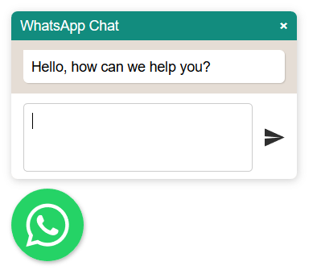
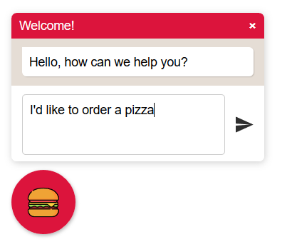

# Floating WhatsApp

This is a very simple floating WhatsApp button plugin for jQuery.

It adds a floating-like button to your site that calls the [WhatsApp Click to Chat API](https://faq.whatsapp.com/en/26000030/).

It will automatically begin a WhatsApp chat with the number set when the user clicks the button.

You an also activate a fake chat window with a customized message where the user can input their reply before opening WhatsApp.

## Installing

Link the files to your html (make sure you load the files after jQuery)

```html
<script type="text/javascript" src="jquery-3.3.1.min.js"></script>
<script type="text/javascript" src="floating-wpp.min.js"></script>
<link rel="stylesheet" href="floating-wpp.min.css">
```

## How to use it

Create a div element and select it with jQuery, then call the plugin using the function `$().floatingWhatsApp([options])`.

```html
<body>
  <div class="floating-wpp"></div>
</body>
<script type="text/javascript">
  $(function () {
    $('#myDiv').floatingWhatsApp({
      phone: '5491133359850'
    });
  });
</script>
```
### Fake Chat Window

Enable a little fake chat window floating above the button:

```js
$('#myDiv').floatingWhatsApp({
    phone: '5491133359850',
    popupMessage: 'Hello, how can we help you?',
    showPopup: true
});
```



### Customization

You can customize the appearance of the button and the chat window:

```js
$('#myDiv').floatingWhatsApp({
    phone: '5491133359850',
    popupMessage: 'Hello, how can we help you?',
    showPopup: true,
    position: 'right',
    autoOpen: false,
    autoOpenTimeout: 4000,
    message: 'I would like to order a pizza',
    headerColor: 'crimson',
    headerTitle: 'Chat with us in WhatsApp!',
});
```



### Options

| option              | value                                         | default                  | description |
|---------------------|-----------------------------------------------|--------------------------|-------------|
| phone               | `string`                                      | `''`                     | WhatsApp [intenational number](https://faq.whatsapp.com/en/general/21016748) which will receive the message.
| message             | `string`                                      | `''`                     | Message to be sent. If `showPopup` is `true`, the input will be populated with this message.
| position            | `'left'` &#124; `'right'`                     | `'left'`                 | Position of the button the screen.
| popupMessage        | `string`                                      | `''`                     | Message to be shown as a received message in the fake chat.
| showPopup           | `bool`                                        | `false`                  | Show a fake chat popup when the user hovers (on desktop) or clicks the button (on mobile).
| autoOpenTimeout     | `Number`                                      | `0`                      | Set an amount of time in milliseconds for the popup to open automaticaly.
| headerColor         | any css color `string`                        | `'#128C7E'`              | Background color of the popup window title bar.
| headerTitle         | `string`                                      | `'WhatsApp Chat'`        | Text to be displayed at the popup window title bar.
| buttonImage         | `jQuery` object &#124; css selector `string`  | [this one](whatsapp.svg) | Button background image. Must be an `img` or `svg` in order to be displayed properly.
| zIndex              | `Number` &#124; `string`                      | none                     | Overrides `.floating-wpp` div z-index. Use a z-index css property value.
| showOnIE            | `boolean`                                     | `true`                   | Whether to show or not the button on IE (recommended, since IE does not support WhatsApp Web).
| size                | `string` (Any css option valid for width and height properties) | `'72px'` | The size of the button
| backgroundColor     | Any css color `string`                        | `'#25D366'`               | The button backgrund color.
